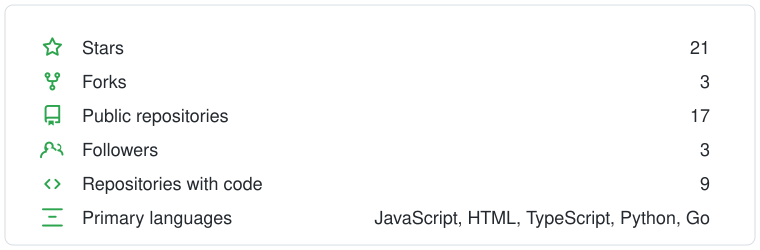

# 👋 Hi there! I'm Shuyang

---

I'm a software engineer and builder studying **Mathematics** with a **Computer Science minor** at the University of Illinois Urbana-Champaign.

I enjoy building products at the intersection of **AI, backend systems, and full-stack development**, especially projects involving real-time systems, AI agents, distributed architectures, and developer workflows.

 

### 🚀 Featured Projects

| Project | What it does | Stack / Focus |
|---|---|---|
| **AI Voice Agent Platform** | Real-time AI sales agent with RAG, agentic workflows, speech-to-text, text-to-speech, human handoff, and post-call analysis. | AI Agents · RAG · Realtime Systems |
| **UIUC Housing AI** | AI-powered housing search platform for students to discover and compare apartments through conversational search, maps, and structured listings. | Full-stack · Maps · Search |
| **Distributed E-Commerce System** | Microservices-based online shopping platform designed for high-concurrency traffic and distributed system patterns. | Spring Boot · Redis · RocketMQ · Docker · Kubernetes · AWS |
| **Tang Matcha House** | Full-stack ordering system with real-time order updates, REST APIs, serverless infrastructure, caching, and automated testing. | React · APIs · Serverless · Testing |

 

### 🧰 Tech Stack

| Category | Technologies |
|---|---|
| **Languages** | Python · Java · TypeScript · JavaScript · C++ |
| **Frontend** | React · Next.js · Angular · HTML · CSS |
| **Backend** | Spring Boot · Spring Cloud · Node.js · FastAPI · REST · WebSockets · gRPC |
| **AI / LLM** | RAG · LangChain · LLM Agents · Vector Search · Speech-to-Text · Text-to-Speech |
| **Data & Infrastructure** | PostgreSQL · MySQL · Redis · DynamoDB · Docker · Kubernetes · AWS · CI/CD |

 

### 🌱 What I'm Interested In

- Backend and distributed systems
- Applied AI and agentic systems
- Real-time communication systems
- Cloud infrastructure and scalable applications
- Building products end-to-end, from architecture to deployment

 

### 📊 GitHub Statistics

 

## 🧩 LeetCode

<!-- Hidden for now:
<a href="https://leetcode.com/u/shuyangzhang321/">
  <picture>
    <source media="(prefers-color-scheme: dark)" srcset="https://leetcode-stats-six.vercel.app/shuyangzhang321?theme=dark">
    
  </picture>
</a>
-->

<a href="https://leetcode.com/u/shuyangzhang321/">
  <picture>
    <source media="(prefers-color-scheme: dark)" srcset="https://leetcode-stats-six.vercel.app/shuyangzhang321/graph?theme=dark&width=760">
    
  </picture>
</a>

 

